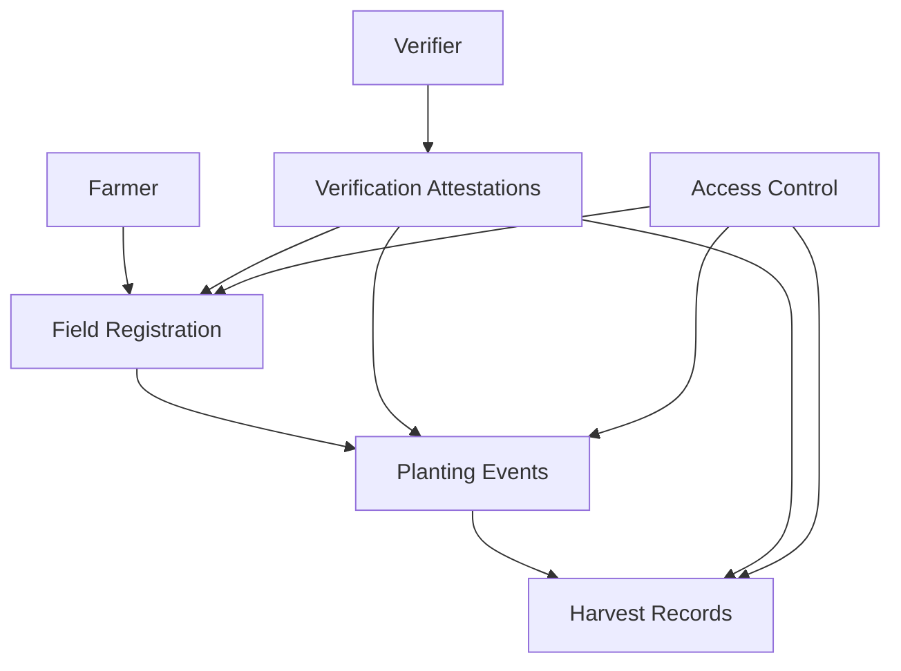

# Agricultural Yield Tracking System (HarvestPro)

A blockchain-based solution for creating transparent and verifiable records of agricultural production data across the supply chain. HarvestPro enables farmers, distributors, and consumers to track crop yields with immutable data storage on the Stacks blockchain.

## Overview

HarvestPro provides a comprehensive system for:
- Field registration and management
- Planting and harvest event tracking
- Third-party verification of agricultural data
- Granular access control for sensitive information
- Supply chain transparency and traceability

The system serves multiple stakeholders:
- Farmers can document their agricultural activities
- Verifiers can certify compliance and quality
- Distributors can track produce origin
- Consumers can verify product authenticity

## Architecture

The system is built on a single smart contract that manages interconnected data structures for agricultural tracking.



Core components:
- Farmer registry
- Field management
- Planting events
- Harvest records
- Verification system
- Access control layer

## Contract Documentation

### Data Structures

1. **Farmers Map**
   - Stores farmer details including name, location, and status
   - Indexed by farmer's principal

2. **Fields Map**
   - Records field characteristics and ownership
   - Tracks location, size, and soil type
   - Indexed by field ID

3. **Plantings Map**
   - Documents planting events with crop details
   - Links to specific fields and farmers
   - Indexed by planting ID

4. **Harvests Map**
   - Stores harvest data including yield and quality metrics
   - Connected to planting events
   - Indexed by harvest ID

5. **Verifiers Map**
   - Maintains authorized third-party verifier information
   - Specifies verification type and status

### Key Functions

#### Farmer Operations
```clarity
(define-public (register-farmer (name (string-ascii 100)) (location (string-ascii 100))))
(define-public (register-field (location (string-ascii 255)) (size-hectares uint) (soil-type (string-ascii 50))))
(define-public (record-planting (field-id uint) (crop-type (string-ascii 100)) ...))
(define-public (record-harvest (planting-id uint) (yield-amount uint) ...))
```

#### Verification Operations
```clarity
(define-public (register-verifier (name (string-ascii 100)) (verification-type (string-ascii 100))))
(define-public (submit-verification (target-type (string-ascii 20)) (target-id uint) ...))
```

#### Access Control
```clarity
(define-public (grant-data-access (data-type (string-ascii 20)) (data-id uint) ...))
(define-public (revoke-data-access (data-type (string-ascii 20)) (data-id uint) ...))
```

## Getting Started

### Prerequisites
- Clarinet installed
- Stacks wallet for deployment
- Basic understanding of Clarity and Stacks blockchain

### Installation
1. Clone the repository
2. Install dependencies with Clarinet
3. Deploy contract to testnet or mainnet

### Basic Usage

1. Register as a farmer:
```clarity
(contract-call? .harvest-pro register-farmer "John Doe" "California, USA")
```

2. Register a field:
```clarity
(contract-call? .harvest-pro register-field "North Field 1" u100 "Clay Loam")
```

3. Record planting:
```clarity
(contract-call? .harvest-pro record-planting u1 "Corn" u1234567 "Organic seeds" "Weather: Sunny")
```

## Security Considerations

1. Access Control
   - All sensitive operations require appropriate authorization
   - Data access can be granularly controlled
   - Only field owners can record plantings and harvests

2. Data Validation
   - Input validation for all parameters
   - Proper error handling for invalid operations
   - Sequential ID generation for various records

3. Verification System
   - Only registered verifiers can submit attestations
   - Verification history is immutable
   - Multiple verification types supported

## Development

### Testing
1. Run included test suite:
```bash
clarinet test
```

2. Deploy to testnet:
```bash
clarinet deploy --testnet
```

### Best Practices
- Always verify transaction sender authorization
- Maintain proper data relationships between records
- Use appropriate error codes for failed operations
- Keep data fields within size limits
- Follow organic/fair trade certification requirements when implementing verifications